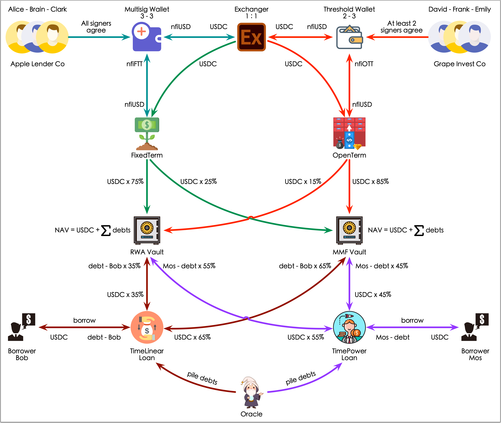
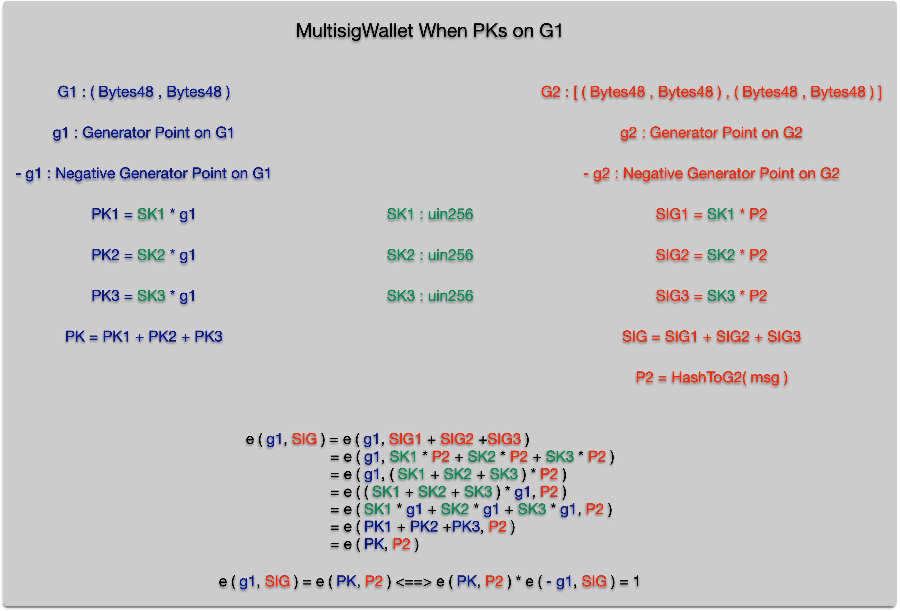
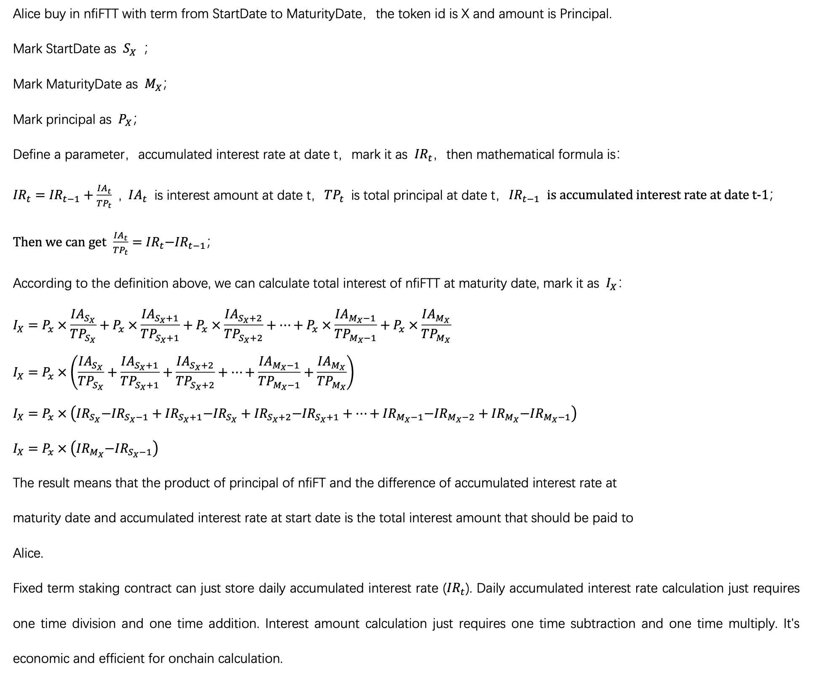

# NexusFi Protocol
## Overview

### Lender Entity
* **Apple Lender Co :** a lender company
  * **Staff:**
    * **Alice:** a signer holding private key
    * **Brain:** a signer holding private key
    * **Clark:** a signer holding private key
  * **Wallet:**
    * **Multisig:** 3 signers in total and 1 aggregated signature from all signers required
* **Grape Invest Co :** an investment company
  * **Staff:**
    * **David:** a signer holding private key and onchain id
    * **Frank:** a signer holding private key and onchain id
    * **Emily:** a signer holding private key and onchain id
  * **Wallet:**
    * **Threshold:** 3 signers in total and 1 aggregated signature from at least 2 signers required
### Personal Borrower
* **Bob :** a borrower who prefer long term fund
* **Mos :** a borrower who prefer short term fund
### Contracts
* **MultisigWallet**  
  This is a n - n wallet where n means the total signers. Multisig wallet contract holds an aggregated public key built from all signers' public keys. Multisig wallet contract is built on BLS algorithm and support two modes:   
  * **Public key on G1 and Private key on G2 :**  
  Public key is a point on G1 which has two coordinates. Each coordinate are 48 bytes (uint384) that stores in 2 words (bytes32).  
  Signature is a point on G2 which has two complex coordinates. Each complex coordinate consists of a real part and imaginary part. Both real part and imaginary part are 48 bytes (uint384) that stores in 2 words (bytes32).  
  * **Public key on G2 and Private key on G1 :**  
  Public key is a point on G2 which has two complex coordinates. Each complex coordinate consists of a real part and imaginary part. Both real part and imaginary part are 48 bytes (uint384) that stores in 2 words (bytes32).  
  Signature is a point on G1 which has two coordinates. Each coordinate are 48 bytes (uint384) that stores in 2 words (bytes32).  
  The following two pictures show **the prototype design of multisig wallet**:  
  
  
  > Note: EVM version should be Prague or later. Because BLS alogrithm in Multisig Wallet contract depends on precompiled contracts:  
  > 1. 0x0b BLS12_G1ADD
  > 2. 0x0c BLS12_G1MSM
  > 3. 0x0d BLS12_G2ADD
  > 4. 0x0e BLS12_G2MSM
  > 5. 0x0f BLS12_PAIRING_CHECK
  > 6. 0x10 BLS12_MAP_FP_TO_G1
  > 7. 0x11 BLS12_MAP_FP2_TO_G2
* **ThresholdWallet**  
  This is a m - n wallet where n means the total signers and m means the minimum signers required (the threshold). Threshold wallet contract holds all signers' public keys and onchain memory ids. Each signer's member id is signed by all signers. In another word, each signer is consensus by all participants. Multisig wallet contract is built on BLS algrorithm and support two modes:
  * **Public key on G1 and Private key on G2 :**  
  Public key is a point on G1 which has two coordinates. Each coordinate are 48 bytes (uint384) that stores in 2 words (bytes32).  
  Signature and onchain member id are points on G2 which has two complex coordinates. Each complex coordinate consists of a real part and imaginary part. Both real part and imaginary part are 48 bytes (uint384) that stores in 2 words (bytes32).  
  * **Public key on G2 and Private key on G1 :**  
  Public key is a point on G2 which has two complex coordinates. Each complex coordinate consists of a real part and imaginary part. Both real part and imaginary part are 48 bytes (uint384) that stores in 2 words (bytes32).  
  Signature and onchain member id are points on G1 which has two coordinates. Each coordinate are 48 bytes (uint384) that stores in 2 words (bytes32).  
  The following two pictures show **the prototype design of threshold wallet**:  
  
  
  > Note: EVM version should be Prague or later. Because BLS alogrithm in Threshold Wallet contract depends on precompiled contracts:  
  > 1. 0x0b BLS12_G1ADD
  > 2. 0x0c BLS12_G1MSM
  > 3. 0x0d BLS12_G2ADD
  > 4. 0x0e BLS12_G2MSM
  > 5. 0x0f BLS12_PAIRING_CHECK
  > 6. 0x10 BLS12_MAP_FP_TO_G1
  > 7. 0x11 BLS12_MAP_FP2_TO_G2
* **UnderlyingToken**  
  This is a ERC20 token that is used for circulation inside protocol (e.g. call it nfiUSD for short). Each participant should hold nfiUSD for different purposes. For example, lender should earn interest by staking nfiUSD into fixed term or open term staking protocols. All accepted assets by NexusFi protocol, such as USDC or USDT, can be used to exchange for nfiUSD.
* **UnderlyingTokenExchanger**  
  This is an exchanger between underlying asset (e.g. USDC or USDT) and underlying token (e.g. nfiUSD). But this is not an AMM protocol that DEX oftern used. Maybe it can be in the future but not now. It usually has a fixed rate betweeen underlying asset and underlying token.  
  We are planning to build an oracle to support unstable coin asset.
* **FixedTermStaking**  
  Fixed term staking protocol is used for a long term investment, such as 30 or 180 or 360 days. It is suitable for investors who have much idle fund and are willing to stick to gain high yeilds.  
  Investors will get NFT tokens (e.g. call it nfiFTT) after they stake nftUSD. Each nfiFFT token is unique because of the different start date, maturity date and principal.  
  Fixed term staking conract stores daily accumulated interest rates for caculation of any nfiFFT token's interest amount at any day before or at or after maturity date. Daily accumulated interest rates make calculation more efficiency on chain.  
  The following picture shows **the basic mathematical formula**.
  
* **FixedTermToken**  
* **OpenTermStaking**  
* **OpenTermToken**  
* **ValueInflationVault**  
* **TimeLinearLoan**  
* **TimePowerLoan**  
* **Whitelist**  
* **Blacklist**  

## Usage

### Build

```shell
$ forge build
```

### Test

```shell
$ make testMultisigWallet
$ make testThresholdWallet
$ make testFixedTermStaking
$ make testOpenTermStaking
$ make testUnderlyingTokenExchanger
$ make testWhitelist
$ make testBlacklist
$ make testTimePowerLoan
$ make testTimeLinearLoan
$ make testValueInflationVault
$ make testInvariant
$ make testAll
$ make coverage
$ make coverageReport
```

### Deploy
