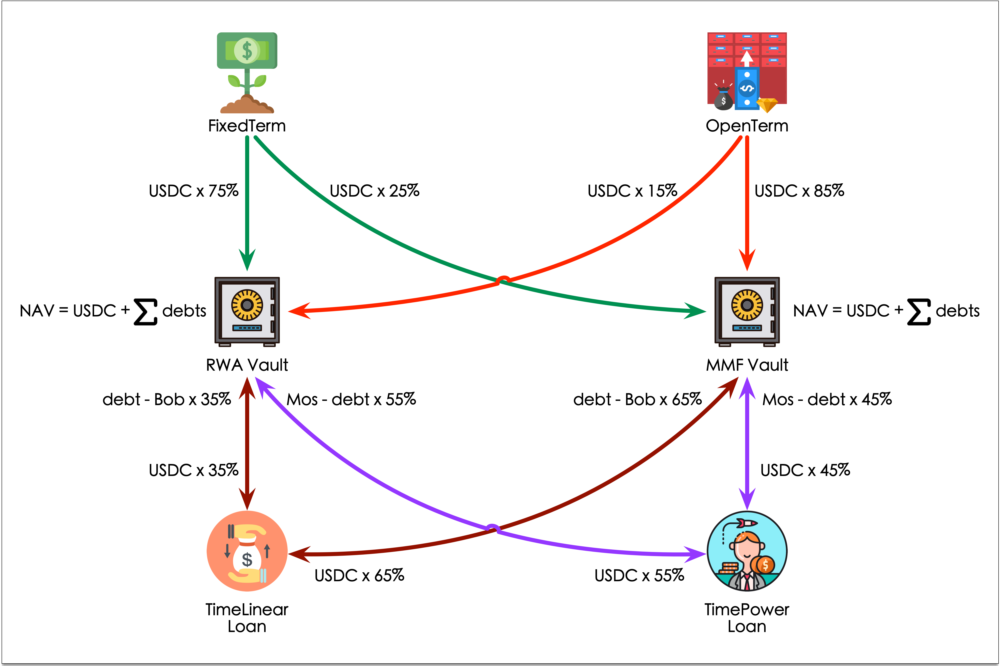
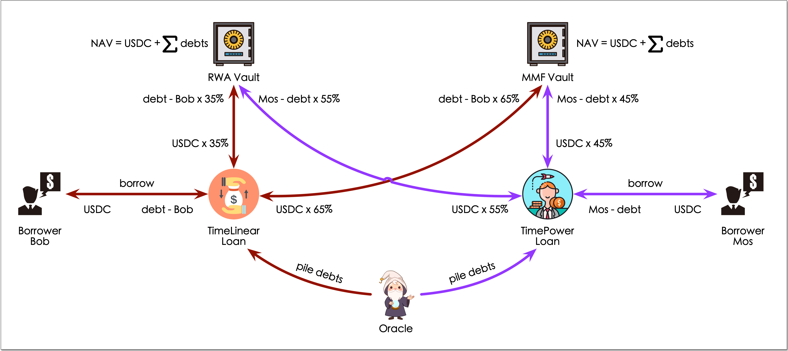
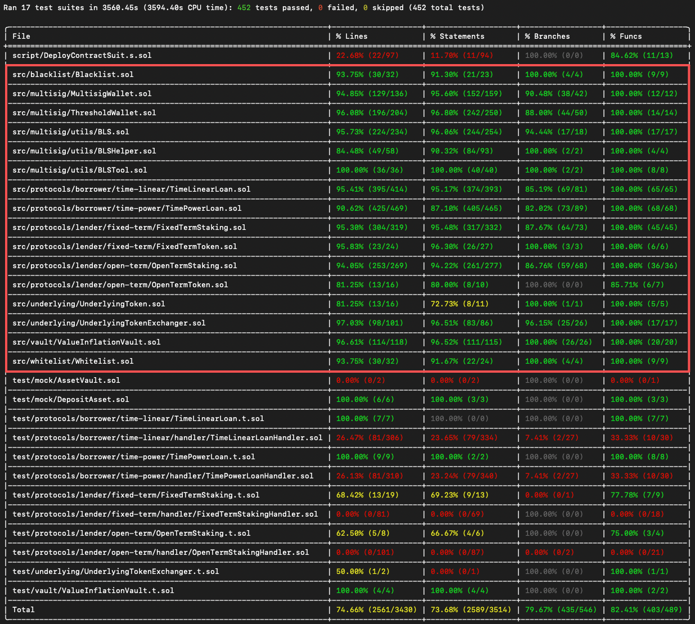

# NexusFi Protocol
## Overview

### Lender Entity
* **Apple Lender Co :** a lender company
  * **Staff:**
    * **Alice:** a signer holding private key
    * **Brain:** a signer holding private key
    * **Clark:** a signer holding private key
  * **Wallet:**
    * **Multisig:** 3 signers in total and 1 aggregated signature from all signers required
* **Grape Invest Co :** an investment company
  * **Staff:**
    * **David:** a signer holding private key and onchain id
    * **Frank:** a signer holding private key and onchain id
    * **Emily:** a signer holding private key and onchain id
  * **Wallet:**
    * **Threshold:** 3 signers in total and 1 aggregated signature from at least 2 signers required
### Personal Borrower
* **Bob :** a borrower who prefer long term fund
* **Mos :** a borrower who prefer short term fund
### Contracts
* **[MultisigWallet](https://github.com/mosheng-eng/NexusFi/blob/master/src/multisig/MultisigWallet.sol)**  
  This is a n - n wallet where n means the total signers. Multisig wallet contract holds an aggregated public key built from all signers' public keys. Multisig wallet contract is built on BLS algorithm and support two modes:   
  * **Public key on G1 and Private key on G2 :**  
  Public key is a point on G1 which has two coordinates. Each coordinate is 48 bytes (uint384) stored in two words (bytes32).  
  Signature is a point on G2 which has two complex coordinates. Each complex coordinate consists of a real part and imaginary part. Both real part and imaginary part are 48 bytes (uint384) stored in two words (bytes32).  
  * **Public key on G2 and Private key on G1 :**  
  Public key is a point on G2 which has two complex coordinates. Each complex coordinate consists of a real part and imaginary part. Both real part and imaginary part are 48 bytes (uint384) stored in two words (bytes32).  
  Signature is a point on G1 which has two coordinates. Each coordinate is 48 bytes (uint384) stored in two words (bytes32).  
  The following two pictures show **the prototype design of multisig wallet**:  
  
  
  > Note: EVM version should be Prague or later. Because BLS algorithm in Multisig Wallet contract depends on precompiled contracts:  
  > 1. 0x0b BLS12_G1ADD
  > 2. 0x0c BLS12_G1MSM
  > 3. 0x0d BLS12_G2ADD
  > 4. 0x0e BLS12_G2MSM
  > 5. 0x0f BLS12_PAIRING_CHECK
  > 6. 0x10 BLS12_MAP_FP_TO_G1
  > 7. 0x11 BLS12_MAP_FP2_TO_G2
* **[ThresholdWallet](https://github.com/mosheng-eng/NexusFi/blob/master/src/multisig/ThresholdWallet.sol)**  
  This is a m - n wallet where n means the total signers and m means the minimum signers required (the threshold). Threshold wallet contract holds all signers' public keys and onchain memory ids. Each signer's member id is signed by all signers. In other words, each signer’s membership is agreed upon by all participants through consensus. Multisig wallet contract is built on BLS algorithm and support two modes:
  * **Public key on G1 and Private key on G2 :**  
  Public key is a point on G1 which has two coordinates. Each coordinate is 48 bytes (uint384) stored in two words (bytes32).  
  Signature and onchain member id are points on G2 which has two complex coordinates. Each complex coordinate consists of a real part and imaginary part. Both real part and imaginary part are 48 bytes (uint384) stored in two words (bytes32).  
  * **Public key on G2 and Private key on G1 :**  
  Public key is a point on G2 which has two complex coordinates. Each complex coordinate consists of a real part and imaginary part. Both real part and imaginary part are 48 bytes (uint384) stored in two words (bytes32).  
  Signature and onchain member id are points on G1 which has two coordinates. Each coordinate is 48 bytes (uint384) stored in two words (bytes32).  
  The following two pictures show **the prototype design of threshold wallet**:  
  
  
  > Note: EVM version should be Prague or later. Because BLS algorithm in Threshold Wallet contract depends on precompiled contracts:  
  > 1. 0x0b BLS12_G1ADD
  > 2. 0x0c BLS12_G1MSM
  > 3. 0x0d BLS12_G2ADD
  > 4. 0x0e BLS12_G2MSM
  > 5. 0x0f BLS12_PAIRING_CHECK
  > 6. 0x10 BLS12_MAP_FP_TO_G1
  > 7. 0x11 BLS12_MAP_FP2_TO_G2
* **[UnderlyingToken](https://github.com/mosheng-eng/NexusFi/blob/master/src/underlying/UnderlyingToken.sol)**  
  This is a ERC20 token that is used for circulation inside protocol (e.g. referred to as nfiUSD). Each participant should hold nfiUSD for different purposes. For example, lender should earn interest by staking nfiUSD into fixed term or open term staking protocols. All accepted assets by NexusFi protocol, such as USDC or USDT, can be used to exchange for nfiUSD.
* **[UnderlyingTokenExchanger](https://github.com/mosheng-eng/NexusFi/blob/master/src/underlying/UnderlyingTokenExchanger.sol)**  
  This is an exchanger between underlying asset (e.g. USDC or USDT) and underlying token (e.g. nfiUSD). But this is not an AMM protocol that DEX oftern used. Maybe it can be in the future but not now. It usually has a fixed rate between underlying asset and underlying token.  
  We are planning to build an oracle to support unstable coin asset.
* **[FixedTermStaking](https://github.com/mosheng-eng/NexusFi/blob/master/src/protocols/lender/fixed-term/FixedTermStaking.sol)**  
  Fixed term staking protocol is used for a long term investment, such as 30 or 180 or 360 days. It is suitable for professional investors who have much idle fund and are willing to stick to gain high yeilds.  
  Investors will get NFT tokens (e.g. referred to as nfiFTT) as receipts after they stake nfiUSD. Each nfiFTT token is unique because of the different start date, maturity date and principal.  
  Fixed term staking contract stores daily accumulated interest rates for calculation of any nfiFTT token's interest amount at any day before or at or after maturity date. Daily accumulated interest rates make on-chain interest calculations more efficient.  
  The following picture shows **the basic mathematical formula**.
  
* **[FixedTermToken](https://github.com/mosheng-eng/NexusFi/blob/master/src/protocols/lender/fixed-term/FixedTermToken.sol)**  
  This is a ERC721 token that is used to represent a fixed term staking (e.g. referred to as nfiFTT). Investor will get a specific token id of nfiFTT after stake nfiUSD into fixed term staking protocol. Each nfiFTT token is unique because of the different start date, maturity date and principal.  
  We know that NFT is not friendly to DeFi or vault protocol. So we are working on the wrapper functions of nfiFTT and will upgrade protocol soon.
* **[OpenTermStaking](https://github.com/mosheng-eng/NexusFi/blob/master/src/protocols/lender/open-term/OpenTermStaking.sol)**  
  Open term staking protocol is used for a short term investment, such as overnight stake and unstake. It is suitable for individual investors who have small and distributed fund and prefer to speculate.
  Investors will get ERC20 tokens (e.g. referred to as nfiOTT) as receipts after they stake nfiUSD. All nfiOTT tokens are rebasing token and investors can see the growth of balance in their self-hosted wallet after the oracle feed interest to protocol.
  Open term staking contract stores total supply of nfiOTT and total reserve of nfiUSD (sum of all principal and interest). It works similarly to a vault (ERC4626) but accompanied with an oracle to distribute interest.
* **[OpenTermToken](https://github.com/mosheng-eng/NexusFi/blob/master/src/protocols/lender/open-term/OpenTermToken.sol)**  
  This is a ERC20 token that is used to represent shares of open term staking protocol. All nfiOTT tokens are rebasing token and investors can see the growth of balance in their self-hosted wallet after the oracle feed interest to protocol.
* **[ValueInflationVault](https://github.com/mosheng-eng/NexusFi/blob/master/src/vault/ValueInflationVault.sol)**  
  This is a vault following to ERC4626 standard. It's a bridge between lender protocols (FixedTermStaking & OpenTermStaking) and borrower protocols (TimeLinearLoan & TimePowerLoan). Value inflation vault collects fund from lender protocols and release funds to borrower protocols on demands. Vice versa, value inflation vault earns profits from borrower protocols and distributes bonus to lender protocols. The fund strategy of value inflation vault can be smartly modified during the lifetime of protocol.
  The following picture shows **the relationship among ValueInflationVault, FixedTermStaking, OpenTermStaking, TimeLinearLoan and TimePowerLoan**.
  
* **[TimeLinearLoan](https://github.com/mosheng-eng/NexusFi/blob/master/src/protocols/borrower/time-linear/TimeLinearLoan.sol)**  
  Time linear loan protocol is used for a long term loan because the interest is linearly increasing during time passing. Comparing to time power loan protocol, you will pay less interest amount in the same annual interest rate, repayment strategy and more than one year loan period.  
  Borrowers should request a loan first and borrow from the loan after approved. Borrowers will receive underlying assets, such as USDC or USDT, which are offered from one or multi value inflation vaults. These vaults own some tranches of net asset value from borrowers' debts and earn profits when borrowers repay.
* **[TimePowerLoan](https://github.com/mosheng-eng/NexusFi/blob/master/src/protocols/borrower/time-power/TimePowerLoan.sol)**  
  Time power loan protocol is used for a short term loan because the interest is exponentially increasing during time passing. It's uneconomic for borrowers when they borrow a long term loan, especially over one year if we use annual interest rates.  
  Borrowers should request a loan first and borrow from the loan after approved. Borrowers will receive underlying assets, such as USDC or USDT, which are offered from one or multi value inflation vaults. These vaults own some tranches of net asset value from borrowers' debts and earn profits when borrowers repay.
  
* **[Whitelist](https://github.com/mosheng-eng/NexusFi/blob/master/src/whitelist/Whitelist.sol)**  
  Shared whitelist controller for the  whole protocol.
* **[Blacklist](https://github.com/mosheng-eng/NexusFi/blob/master/src/blacklist/Blacklist.sol)**  
  Shared blacklist  controller for the whole protocol.

## Usage

### Build

You can run this command to **build all contracts**.
```shell
$ forge build
```

### Test

You can run these commands to test each contract.  
Some contracts may cost thousand seconds because they contains fuzz test cases.  
```shell
$ make testMultisigWallet
$ make testThresholdWallet
$ make testFixedTermStaking
$ make testOpenTermStaking
$ make testUnderlyingTokenExchanger
$ make testWhitelist
$ make testBlacklist
$ make testTimePowerLoan
$ make testTimeLinearLoan
$ make testValueInflationVault
```

You can run this command to do all invariant test cases in all contracts.  
This test may fail because the conditions are different in each time you trigger it.  
But it works well in most times based on the past experiences.  
Invariant test cases cost a very long time to get result (maybe hours).
```
$ make testInvariant
```

You can run this command to run all test cases of all contracts, including normal test cases, fuzz test cases and invariant test cases.
```
$ make testAll
```

You can run these commands to generate coverage rate and report.  
Coverage report is located in **[report](https://github.com/mosheng-eng/NexusFi/blob/master/report/coverage.txt)** directory.
```
$ make coverage
$ make coverageReport
```
This is the latest coverage report (you can use **make coverage** to get latest report).  
Just focus on solidity files under **[src](https://github.com/mosheng-eng/NexusFi/tree/master/src)** directory.  
We have tried our best to increase the coverage rate and will continue to work on it.


### Deploy
TOD